## STL标准库

**1. 认识headers,版本、重要资源**

- 标准库与STL

	标准库包含STL，STL包含了6大部件

	- 标准库以 **header files** 形式存在，不带文档名**.h**
		
        ```C++
        #include <vector>
        ```
		
	- 原有C语言中的**C headers files**不带**.h**

		```	C++
        #include <cstdio>  // 表示c库
        #include <stdio.h>
        ```
    - 新式headers内组件封装在namespace std;

- 常用网站

	- CPlusPlus.com
	- CppReference.com
	- gcc.gnu.org

**2. STL体系结构基础**

- 六大组件

	- 容器
		容器储存操作数据
	- 分配器
		解决内存分配问题
	- 算法
		基于容器上的算法
	- 迭代器
		泛化指针，用于数据指针访问
	- 适配器
		实现不同适配器的转换，类似于“变压器”
	- 仿函数
	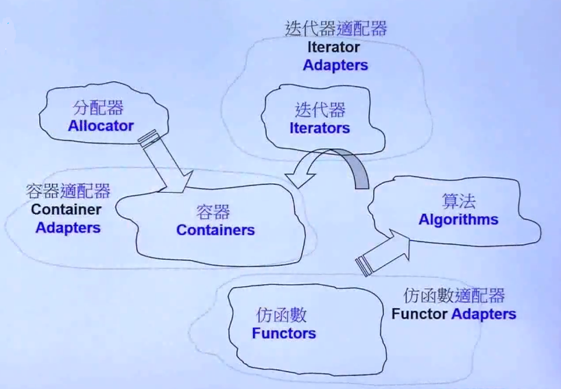
    
    	- **notes**
    	
        	- 数据存储类（容器）与数据操作类（算法）分开，并不符合面向对象的一般原则（数据存储与数据操作被封装到同一个类中）

	- **demo**
	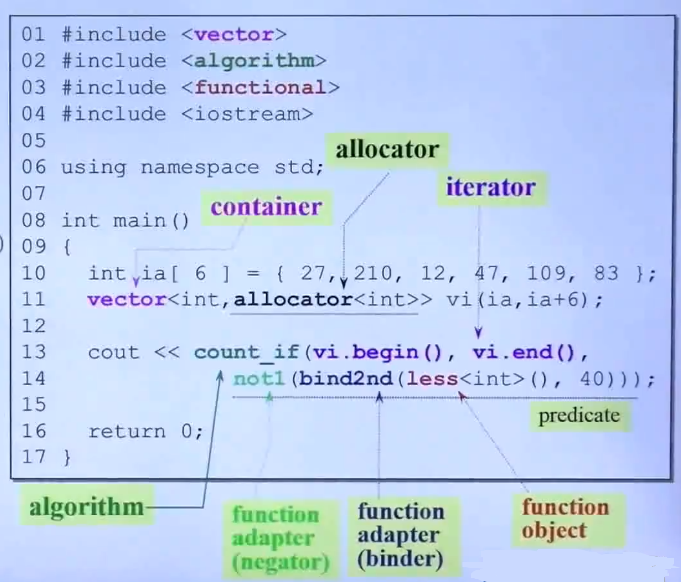
    	- **notes**

			- 不同的容器需要包含对应的头文件
			- 容器第二个模板参数是分配器，有默认分配器
				```C++
                vector<int, allocator<int>>
                - allocator<int>
                	int 类型的分配器
                ```
            - 算法对容器进行操作

				```C++
                count_if(vi.begin(), vi.end(), not1(bind2nd(less<int>(),40)))
                
                - 统计小于40的个数
                - count_if是算法接口
                - vi.begin() 是迭代器，算法支持传入容器的迭代器，对元素进行操作
                - not1(bind2nd(less<int>(),40)) 
                
                	- 整个语句可以表达: 判断满足（不小于40），则是。。。
					- bind2nd() 函数适配器，绑定第二参数
					- less<int>() 函数对象
                ```
- 容器内元素的迭代访问

  - 容器访问的前闭后开区间
	
    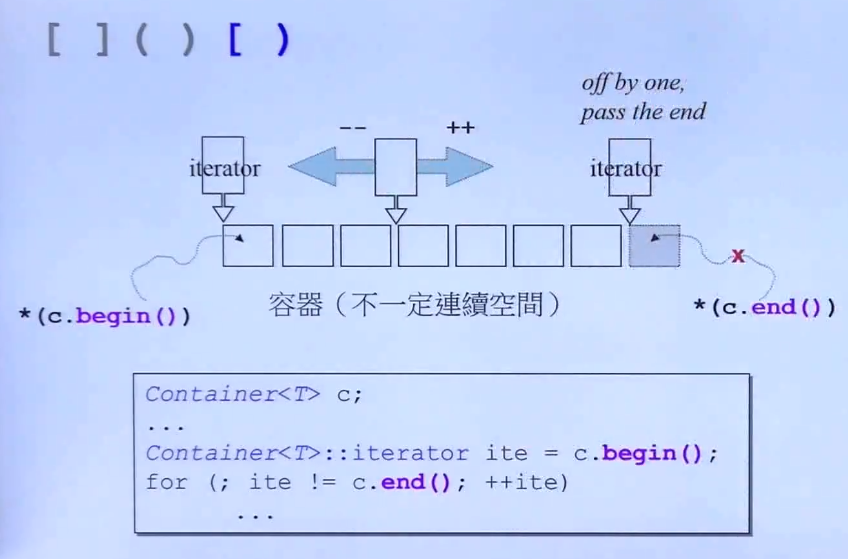
    - **notes**
        - begin() 指向第一个元素
        - end() 指向最后一个元素的下一个元素
        - Container<T> 表明一个容器

 - range-based 表达式（C++11）

	 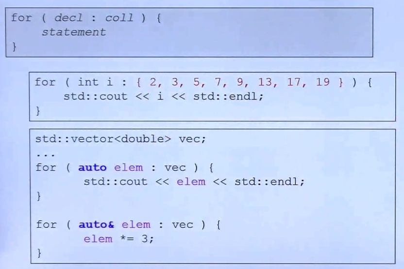
     
     - **notes**
		- coll 表示容器对象
		- auto 自动推导类型，但是程序员自己必须知道类型
		- auto& 表示引用，即对容器元素本身进行操作

 - auto的使用技巧

	- 使用 auto 防止冗长的迭代器声明
	  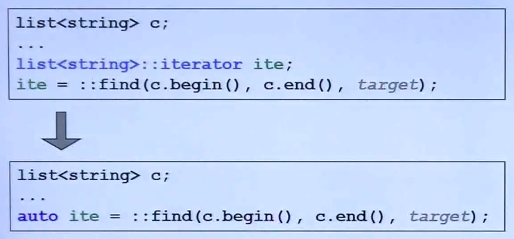
      
      - **notes**
		- ite 类型能够被自动推导

**2. 容器之分类与测试**

- 结构与分类

	- 序列式容器

		- Array
           
           固定大小的连续内存数组  
        - Vector	
            
            只允许从后面进行动态扩容的数组（连续内存）
            
        - deque

			队列、双向队列
            
        - List

			双向链表
            
        - Forward-List
        
        	单向链表
	- 关联式容器
		
        用于快速查找，基于红黑树（高度平衡二叉树）实现的二分查找树，Multi是允许放入重复元素的
        
        - Set/MultiSet

			Set的单个节点仅保存key
        - Map/Multimap    

			Map的单个节点保存了：key和value
        
	- 无序容器（C++11）

		其实也是关联式容器的一种，基于hash table做的
        
        
        
        - **notes**

			- 单链式结构实现
			- 不同的元素通过hashFunc计算出不同的索引，根据这个索引可以快速获取该元素
			- 不同元素计算的hashFunc索引相同，即出现碰撞，单向链表是用来解决，保证出现碰撞元素仍然出于相同索引的位置
	
    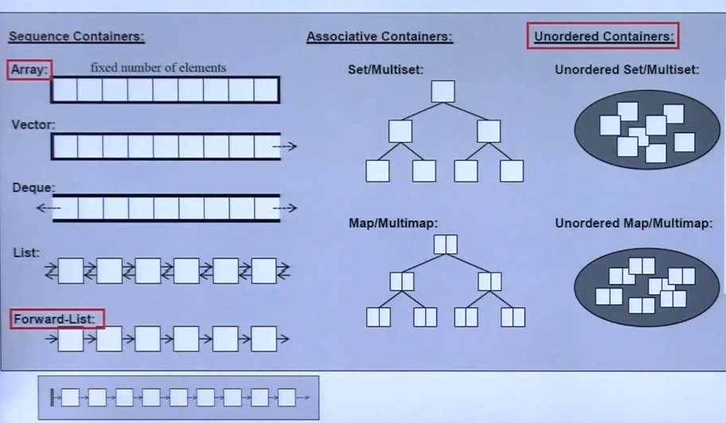
    
    	- **notes**
    	
        	- 红色标记为 C++11 新增
- 容器测试**笔记**

	- 代码规范

		- 将测试函数使用namespace区分
		- 变量定义不缩进与执行流程缩进，方便区分

		```C++
        clock_t timeStart = clock(); // 变量定义不缩进
        	cout << "milli-seconds : " << (clock()-timeStart) << endl;// 执行语句缩进
        ```
        - 对于测试程序要考虑到测试陷阱

		```C++
        try {
        }
        catch(exception& p)
        {
        	cout<<p.what()<<endl;
            absort();
        }
        ```
    
  - 特殊语法

	- ::从全局查找变量函数

        ```C++
        ::find(); // 调用全局的find函数
        ```
    
    - 全局Sort函数以及容器自身的Sort函数选择

		优先使用容器自身的Sort函数
        
    - 查找函数

		- find 顺序查找
		- bsearch 二分查找（前提必须排序）
     
 - vector

	- **capacity** 2倍增长

 - list
		
    - 存在最大容量的限制
 - forward_list

	- 只能通过front从头插入元素
	- 与C中扩展的slist功能相同

 - deque

	 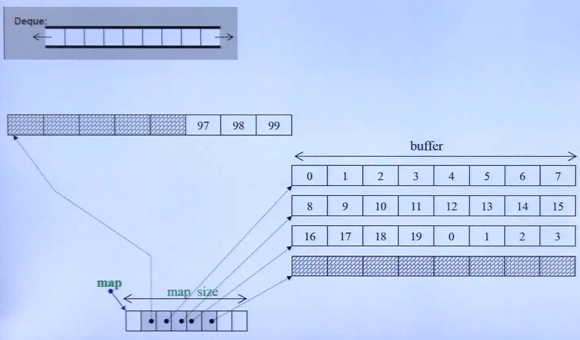
     
     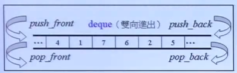
     
     - buffer特点 **分段连续**

		物理上，段与段之间不连续，段内连续
     - 每次会扩充一个buffer size
    
    - 技术上的适配器

		即通过deque的功能进行选择实现的容器
        - stack
			
            不提供iterater
            
            从一端进出元素

            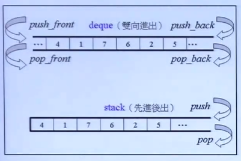

        - queue

			不提供iterater
            
            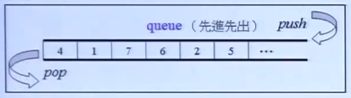
       
- 含有multi的关联式容器（允许重复）            
    - multiset

        基于红黑树的底层实现

       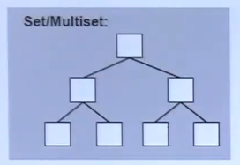

    - multimap

        基于红黑树的底层实现

        基于pair<key,value>的键值对

    - unordered_multiset

        基于hash table实现

        - 每个bucket放入一个单向链表，往往bucket数量大于元素数量
        - 当元素数量接近bucket个数是，bucket将进行扩充，元素重新映射到bucket中

- 含有multi的关联式容器 

	- set
	- map

		支持索引
        
        ```C++
        c[i] = string(buf); // 这里将 (i,string(buf)) 组成 pair 
        ```
    - unordered_set

**2. 分配器与测试**   

- 建议

	- 尽可能通过容器获取数据内存，而不是通过allocator

		因为allocator需要保证**分配与销毁数量相同**