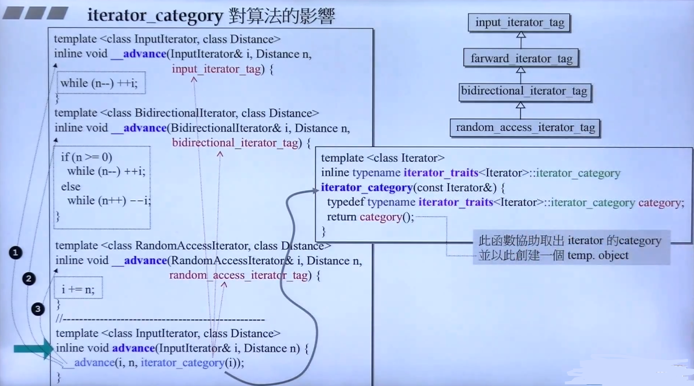

## 算法

- 算法的形式

	
    
    - **Notes**

		- 右下角是算法常用的两种接口形式

- 迭代器的分类

	
    
    - **Notes**

		- 迭代器通常由具体的container 依据自己的特性提供
		- 分类：随机索引（random access）；双向（bidirecition）；单向（forward）；STL 中**没有定义 enum 类型，而是 struct 类型**，主要是因为基于这些类别存在继承关系，而非独立的，方便简化后续的实现 
		 
         - typeid 可以 获取 类对象的命名 **typeid(itr).name()**

 
 
	- **Notes**

		- 通过给定默认参数，保证使用接口一致

- iterator_category 对算法效率的影响
	
    
    
    - **Notes**

		- 不同的 iterator_category 意味着距离计算不同
		- 由于 farward、 bidierection都是继承 input ，所以只要实现input
		- 不同的是 category 的取出方式

  
  
  
  - **Notes**

	- type traits 提供 重要性 的解答
	- 函数前加入 **__** 表示这个函数不直接作为接口 
	- \*read 表示读，Output iterator 是无法进行 读操作的，所以unique_copy 要单独写

 
 - **Notes**

	- 算法源码无法对 iterator_category 无法限制的，只能通过 模板 typename 进行暗示，具体调用 某一块时报错退出

- 算法用例
	
    算法一般会提供两个版本，一个默认版本，一个允许提供仿函数的扩展版本
    
	- accumulate
	
		- **Notes**

			- binary_op 表征了 自己定义的函数指针或者仿函数（函数对象）

	- for_each
	
    	- **Notes**

			- 对每个元素做同一件事情

	- replace & replace_if & replace_copy
	
    借这个算法，提供STL 算法模板的功能式命名
    
		 
         - **Notes**

			- 带 if 表征了外部需要提供一个判断准则的function
			- 带 copy 表征了存在拷贝的动作，不改变源数据

	- 全局算法与关联式容器自带的算法
	
		- count & count_if
			
            统计
			
       
        - find & find_if
        
        	顺序查找
    	
        
        - sort
        
    		- **Notes**
				- rbegin； rend 表示逆向的起止点和终止点

	- 关于反向迭代器
		
        
        
  - 二分搜索

	
	- **Notes**
         - 注意 lower bound 表示下界；upper bound 表征上界
	