## 仿函数functors

- 仿函数

	为算法服务，是一个函数对象，当 **class** 重载了 **()** 运算符，并创建一个对象，虽然是类的对象，但是行为像函数，则就是仿函数
    
    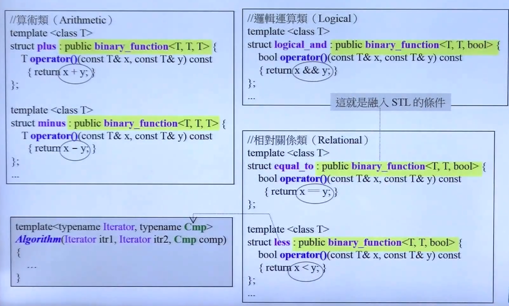
    - **Notes**

		- 仿函数的三大类：算术类、逻辑运算、相对关系
    
  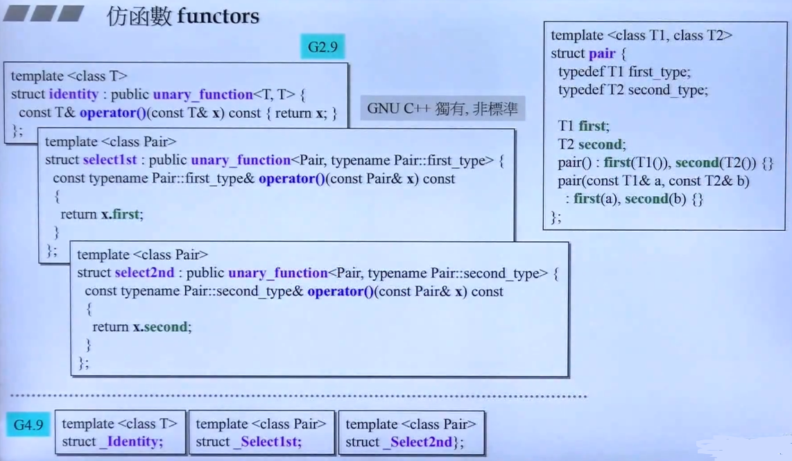
  - **Notes**
	- 特有的仿函数
	- 设计者不应改动重要的接口

  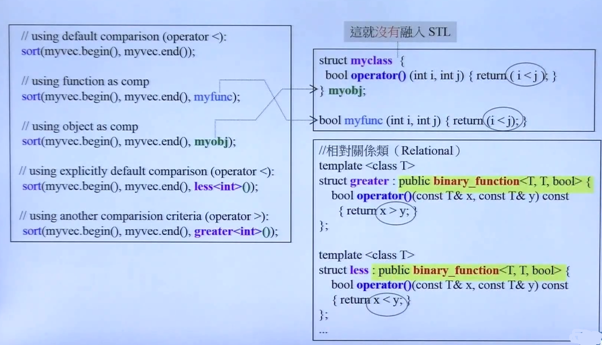
   - **Notes**
       - functor 的自定义需要融入 STL，需要继承 binary function
  
  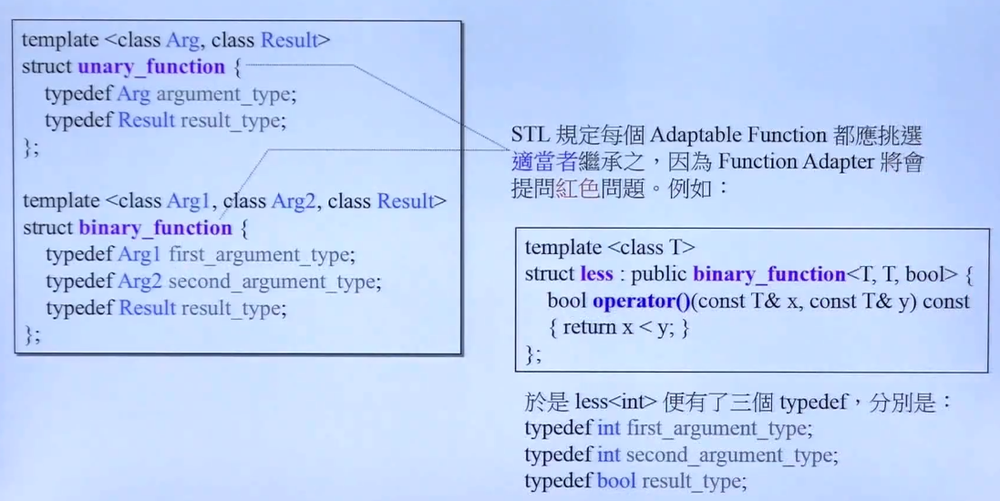
  - **Notes**
       - unary_funtion 表示否定函数系
       - 仿函数继承上述两个函数（unary_funtion or binary function），继承了typedef，这些可能会被其他部件所提问

## 适配器 Adapters

- 适配器
	
    在现有的实现的基础上进行改造，派生的新功能部件
    
    - 适配器的引入
   
   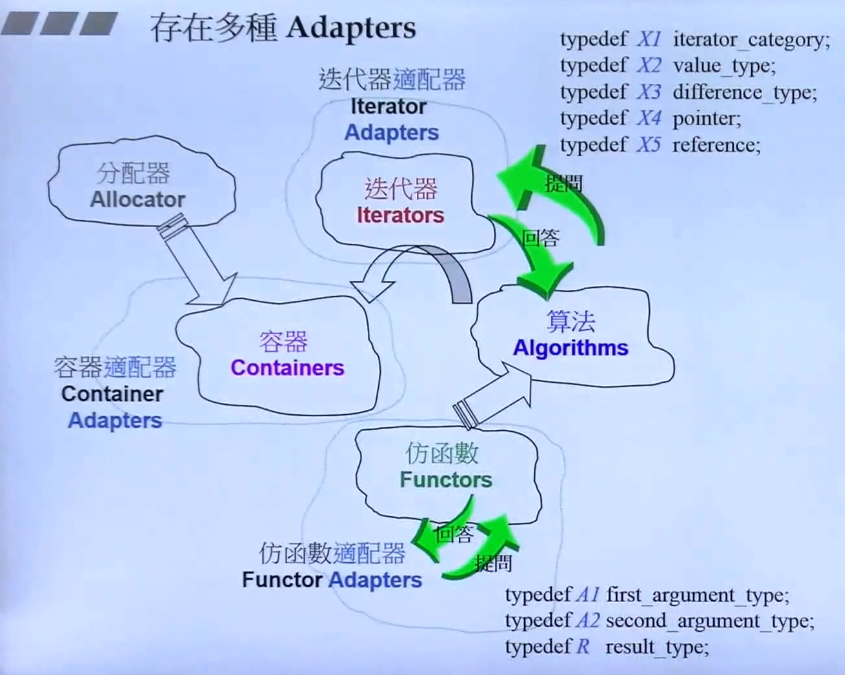
    
       - **Notes**

		- 适配器实际上是一种转调用，是使用者和内部真实实现接口的桥梁
		- Adapter 在技术上都是通过 **内含** 实现，而不是基于**继承**进行实现
		- 仿函数适配器与迭代器适配器 与 算法进行沟通时，就必须满足一定 的 typedef，针对算法的提问进行回答

	- 容器适配器
		
        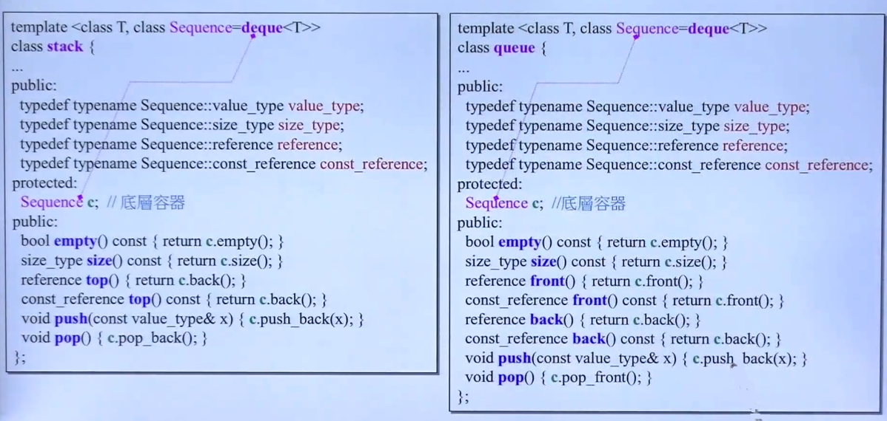
		stack、queue
        
  - 函数适配器
	
    往往通过一个辅助函数，借助辅助函数可以方便调用真实功能的类
    
	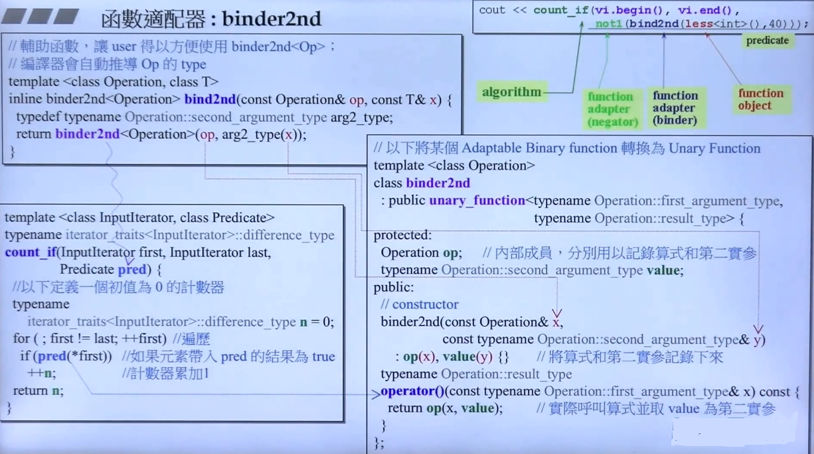
    - 基本语法 typedef 和 typename 的定义
		```C++
        typedef typename Operator::second_argument_type arg2_type;
        
        - typedef创建了存在类型 Operator::second_argument_type 的别名为  arg2_type
        - typename Operator::second_argument_type 则 告诉编译器Operator::second_argument_type 是一个类型而不是一个成员
        ```
    - less< int >() 是对象
    - **bind2nd 会首先将 op：less< int > 以及 value：40 记录下来，在调用 count_if 的地方，才会发生 op(x,value) 的操作**
    - binder2nd 需要指定 < Operation > 的模板参数，用起来相对难以指定，所以提供了另一个接口 bind2nd 进行 < Operation > 的推导
    - binder2nd<Operation>(op, arg2type(x)) 表征的是对象的创建，而不是函数调用 
    - count_if 传进来的参数作为 binder2nd 绑定 op 的第一参数

	- 仿函数的 adaptable 条件
	
    	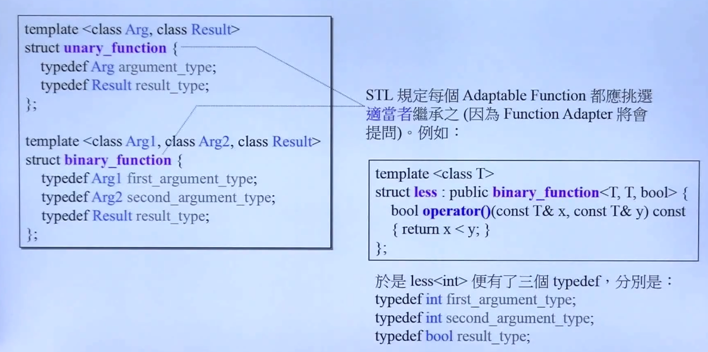
        
        - 可以看到这两个被所有仿函数继承的基类，都进行了typedef 的定义，实际上是将 bind2nd 在绑定 less 的时候，less 就将所有需要的 Arg、Reasult 等模板参数定义为 int | bool ，所以bind2nd 进行 type 询问的时候，就可以回答对应的type
  
     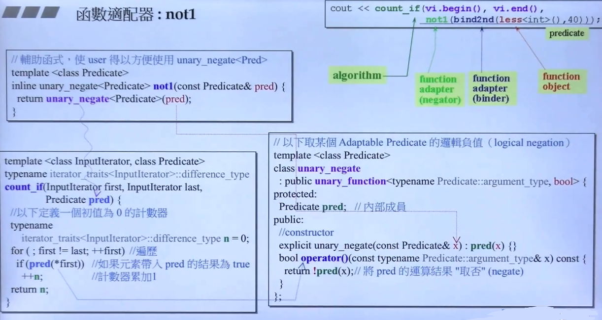
        
    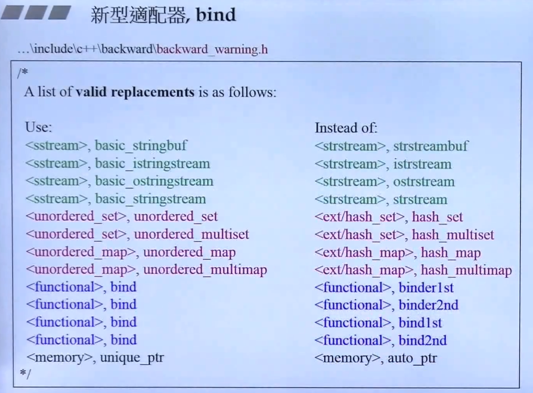
    
    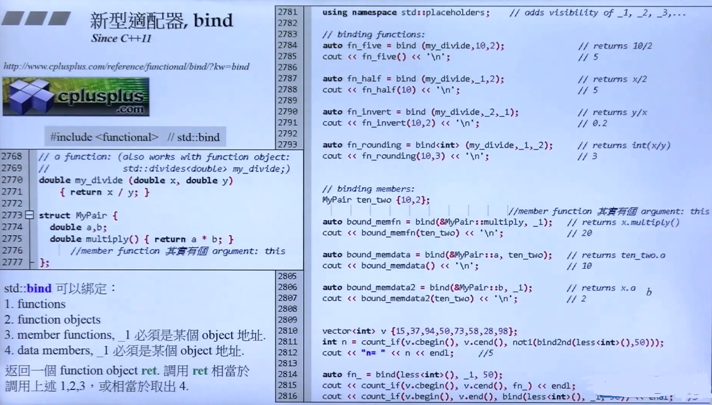
  	- **Notes**

		- 占位符语法

			```C++
            using namespace std::placeholders;
            
            auto fn = bind(my_divide, _2, _1); // _1 表示第一个传入参数的位置
            fn(10,2) ==> fn(2,10);
            ```
        - bind< int > 表征了改变了 return type为 int
        - 成员函数的隐含参数 this

			```C++
            MyPair ten_two{10,2};
            auto boundz_memdata = bind(&Mypair::multiply, _1);
            bound_memfn(ten_two);
            ```
        - cbegin ; cend 表示 const 的 iterator，不允许改变 iterator 指向的值    
        