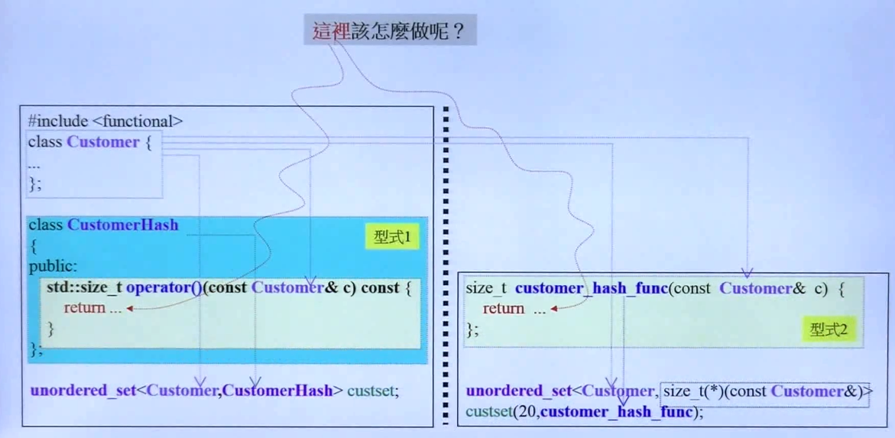
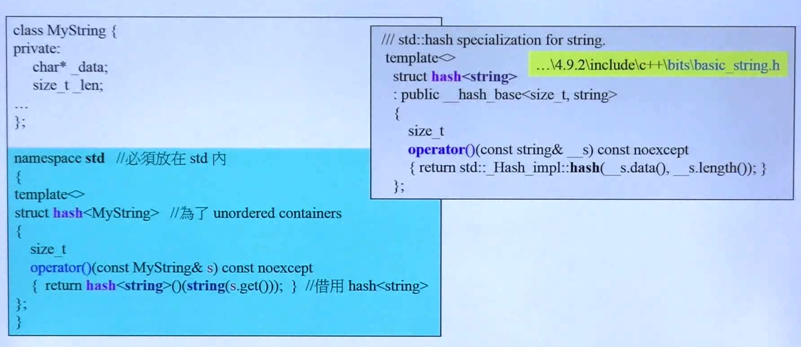
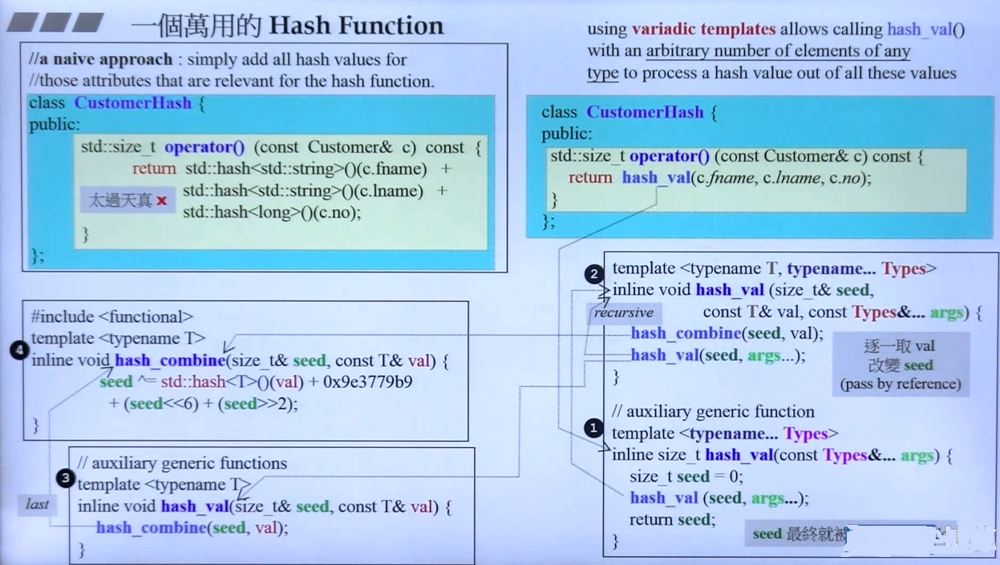
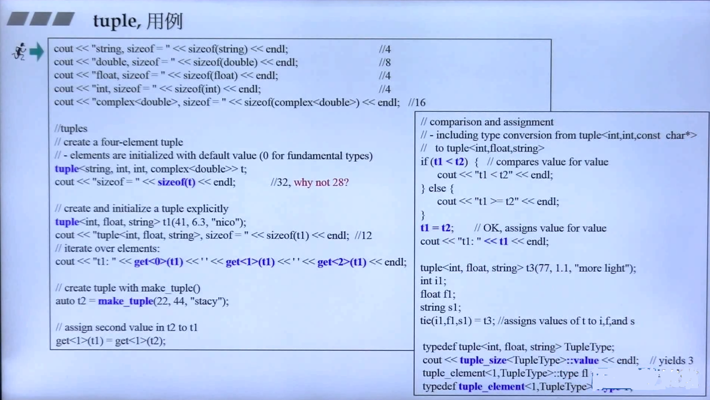
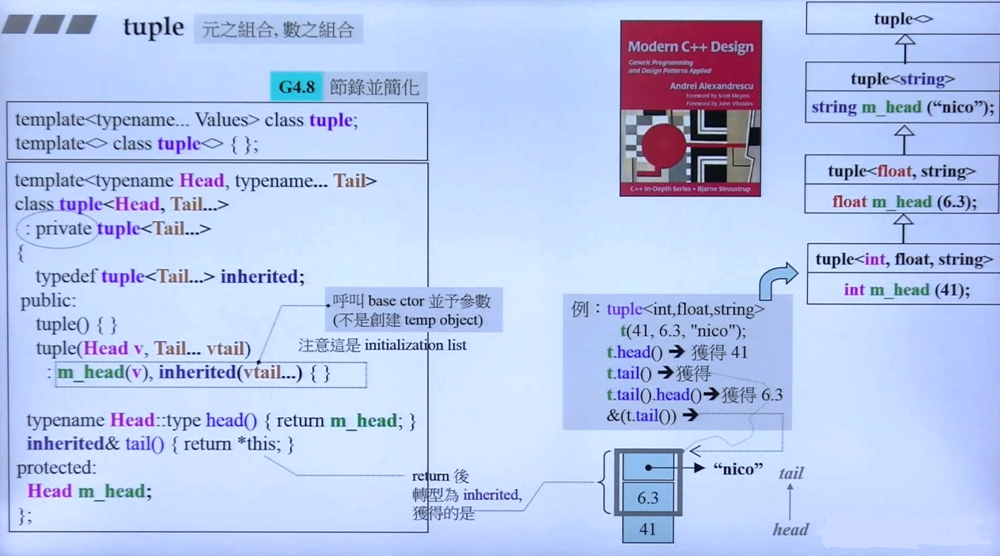
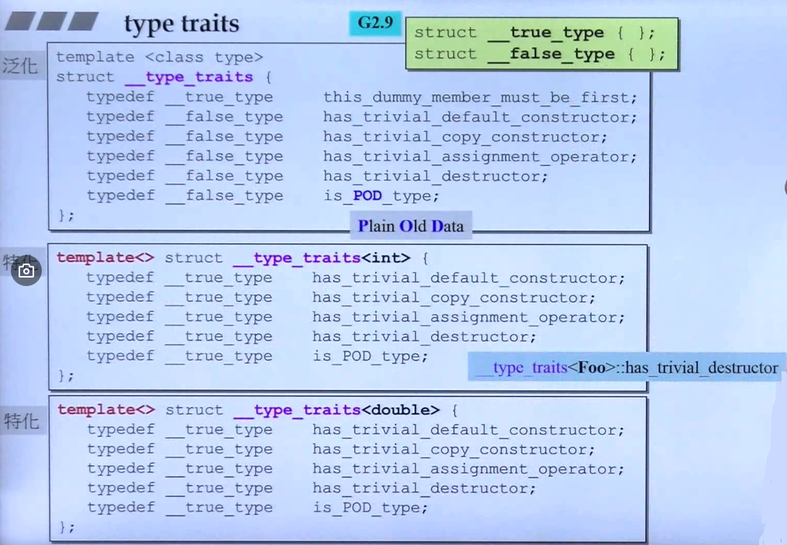
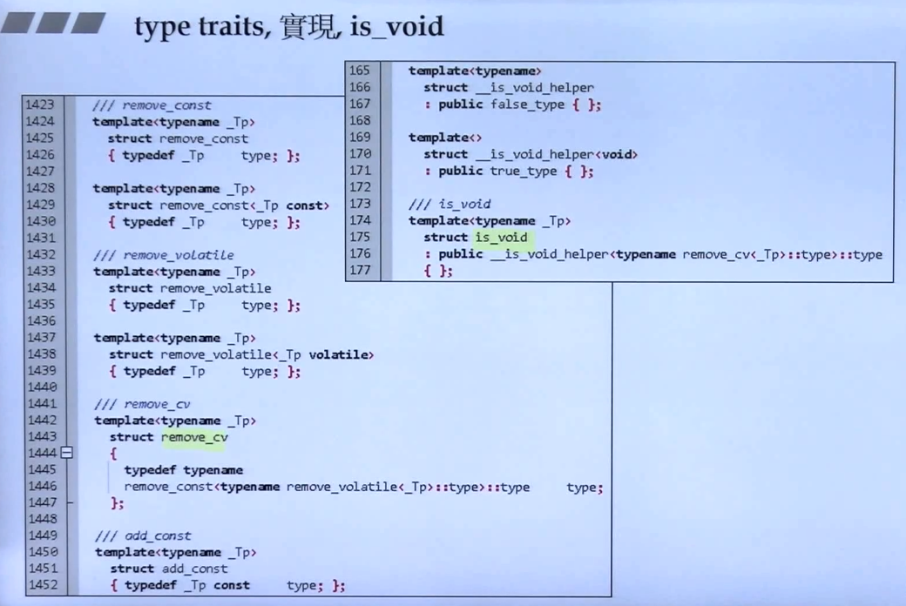
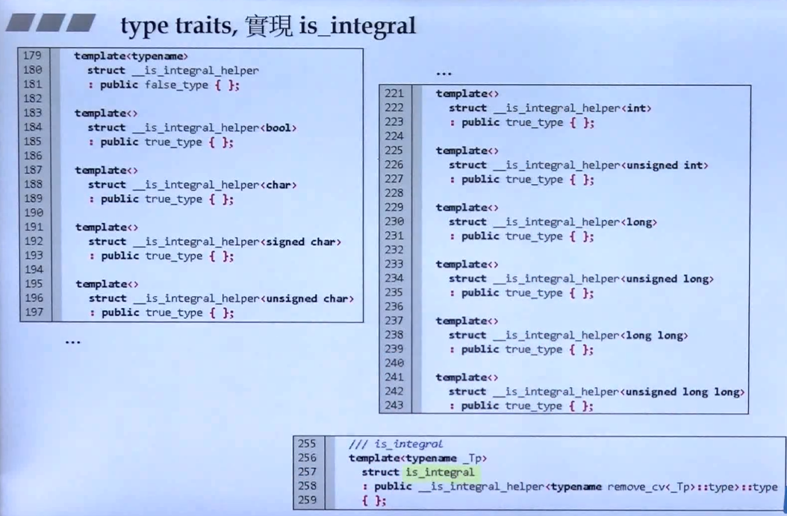

## C++ 标准库的周边（非 STL 组件）

### Hash Function

- Hash Function的基本实现方法
	
    
	- **Notes**

		- 形式1 使用类的成员函数实现 hash ，实际上是一个函数对象
		- 形式2 直接使用函数形式实现 hash
		- 上述两种 hash 搭配 container 的使用方法，形式1 由于传入的本身就是仿函数，所以不需要指明，形式2就需要指明，函数类型以及函数的指针
		- 形式3 也可以使用偏特化，定义自己的 hash
		
	
  
	- **Notes**

		- **template< typename... types >** 表征了任意多个模板参数
		- 调用顺序： operator -> hash_val 1 -> 不断递归调用 hash_val 2 进行模板参数减少 -> 调用函数 3，相当于是从任意多个参数，逐一取出（是一个模板参数拆解的过程）


### tuple

可以容纳不同类型元素的容器

- tuple 基本用法
   
  
   - **Notes**

	- tuple 的构造：

		```C++
        tuple<string, int, int> t("nico", 1, 2);
        
        auto t1 = make_tuple(22,2,"stack");
        
        # 元素获取
        get<0>(t); # 0 表征了 第 0 个 type
        ```
    - 支持操作符重载： <、<<、=
    - tie 的解包操作 

		```C++
        int i1;
        float f1;
        string s1;
        tie(i1,f1,s1) = t3;
        ```
- tuple 基本实现 

	
    
    - **基于模板类，可以继承自己，实现多个参数的递归减少** 
    - 无参数的偏特化作为递归终止条件
    - inherited 存在一个类型转换

### type traits

根据 type traits 的返回决定算法对数据的处理方式

- type traits 的旧版本基本实现
    
   
   - **Notes**

		- 通过对 type traits 的特化版本，表征某种 type 是否重要，例如含有指针的类的析构函数是必要的，而对于整型等基本类型数据析构函数默认即可
		- Plain Old Data 表征了 C 标准的类型

- type traits 新版本的智能实现

	- is_void()

		
		- **Notes**

			- 模板本质是在对类型进行操作
			- remove_const<_Tp const> 是一种偏特化，实现泛化范围的缩小（下同）
			- 实质是一层层询问 type，返回 经由各个特化版本 typedef 的 type 作为最终答案
			- 都是借助辅助函数返回最终的答案

	- is_integral()

		
	
    - is_class、 is_union、 is_enum、  is_pod

		有编译时生成的 type traits

### cout

一个对象

- cout 的源码追踪

	- **Notes**

		- cout 继承 了 ostream ， 充满了 对 << 的操作符重载，所以可以接收基本类型的输出
		- 要想实现对自定义类型的输出，就必须对 << 进行重载