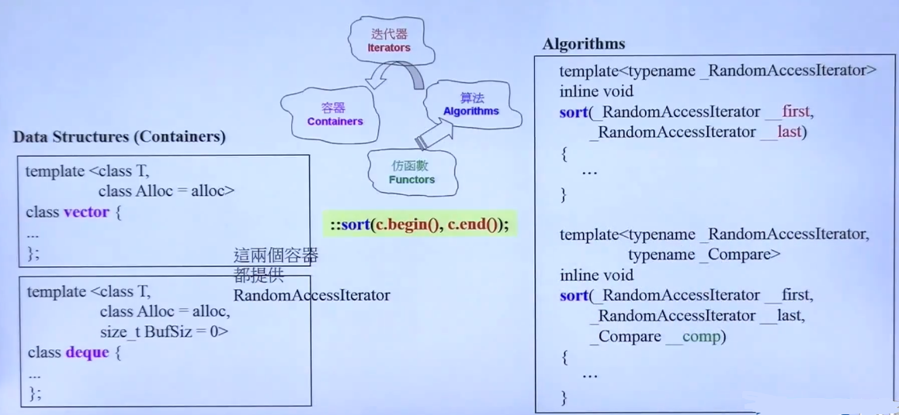

## STL的深度探索基础

**1. OOP（面向对象编程） vs GP（泛型编程）**

- OOP企图将**data**和**method**绑定

	如数据 **list** 与操作 **sort** 进行绑定 
	
    
    - **STL**库无法将 **list** 和 **sort** 分离的主要原因：
    	
        全局sort函数依赖于支持随机索引的容器，而list不支持这类操作，所以只能和list类进行绑定

- GP将**data**和**method**分离

	- GP方法支持不同的模块的并行开发
	
    
    
    	- **notes** 

			- 针对不同的数据结构（如 **vector** 和 **deque**），共用一个算法里的**sort**方法
			- **数据**与**算法**依靠容器的**迭代器**作为桥梁

				**Container** 提供 **algorithms** 需要的 **iterator** 确定操作范围，并通过 **iterator** 获取元素
                
    - 所有算法，内部涉及到元素本身的操作，无非就是比大小，所以需要注意的到比较大小的运算符重载
	
    	
        - 提供了方法comp

**2. Operator Overloading vs Template**

- Operator Overloading

	- 重载方法

		
        - 迭代器的重载

		   
	
	- Template
		
        - 类模板

			  
            
        - 函数模板
			
            函数模板支持实参推导，而类模板不行，必须用**<>**指定
			  
        
        - 特化
			
            - 全特化
           
                针对特定类型的特定流程，一旦类型被特化绑定，则**<>**不需要指定
                  
                ```C++
                - __type_traits<int> 即产生int，进入到特化版本run 
                - __type_traits<foo> 非特化，进入到泛化版本run
                ```

                  
                - Notes

                    - typedef 定义 __STL_TEMPLATE_NULL <=> template
           
        	- 偏特化
          		
                - 个数偏特化
               
               	多个泛化类型中，只有局部的类型被绑定
                  
                
                - 范围偏特化
            	
                
                - Notes
                
                	- Iterator 本来是任意类型（泛化），T\* 表示特化是指针类型时
                 