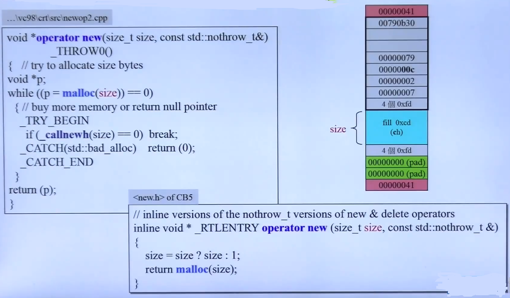
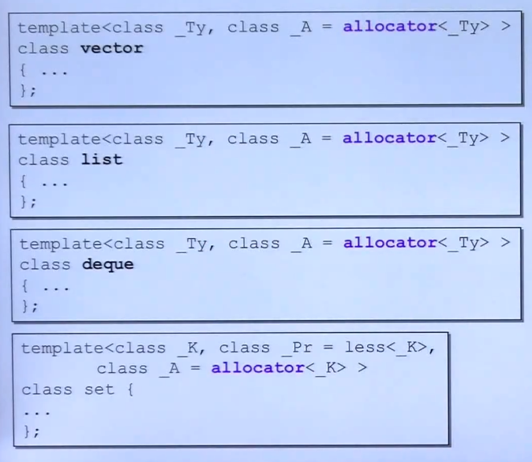
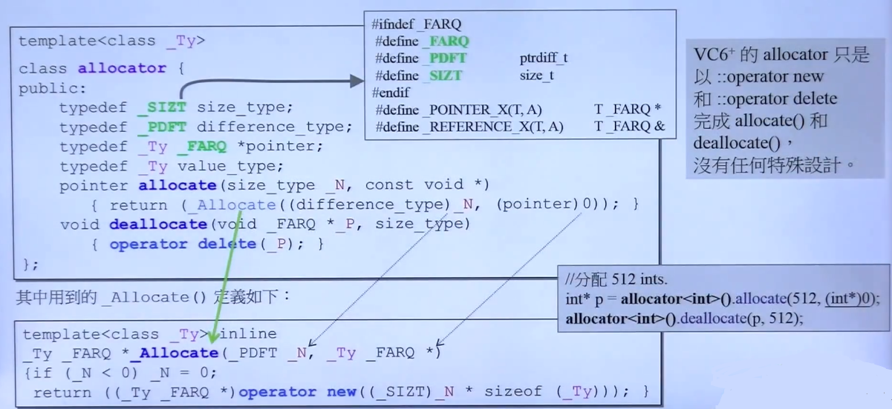
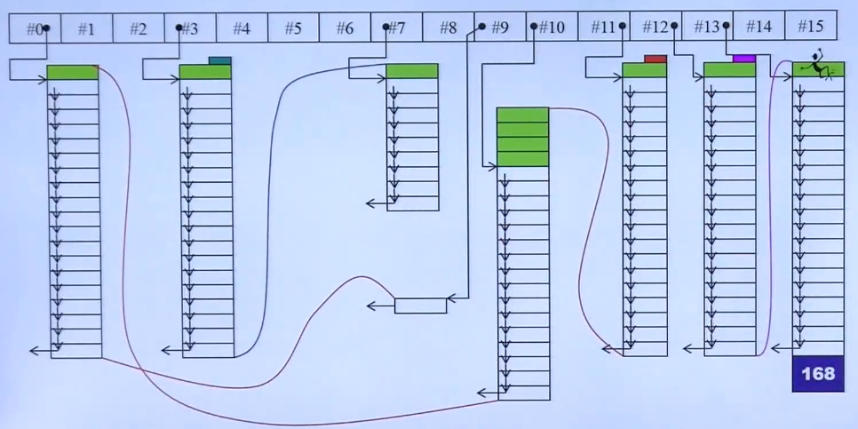
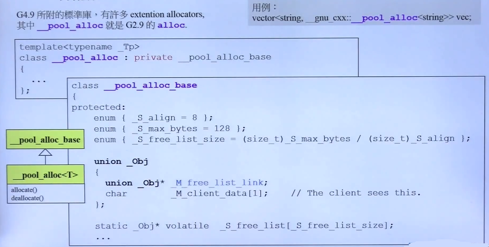

## 分配器

**1. 先谈 Opterator new() 和 malloc()**

   
   
   - 无论是C，C++（Operator new）都最终走向**malloc**分配内存，**malloc**通过调用系统底层的内存分配接口分配内存
   - **malloc**分配内存如图中块所示，尺寸会大于本身所需内存的size（小数据块很容易造成内存浪费）

**2. STL中allocator的使用范例**
	
    
   - 大部分**allocator**的实现源码

	 
    
    - Notes
    	
        - **allocator** 仅仅是C malloc和free函数的封装
        - **allocator< int >()** 表示声明了一个allocator对象
        - **deallocator**释放，必须指定allocator对应的大小
        - 不建议直接使用allocator
    
- **GNUC2.9** 的alloc 的分配设计 

	
    
    - 这种设计主要是为了避免malloc导致的额外开销
    - 具体设计

		- 设计了16条链表，每个链表分配固定大小的空间
		- 这样同一条链表里面的内存共享同一个cookie
	
    - GNUC4.9继续改用了大部分allocator（malloc）的方式，改用pool_alloc

		
        
        - 注意命名空间 **__gnu_cxx**