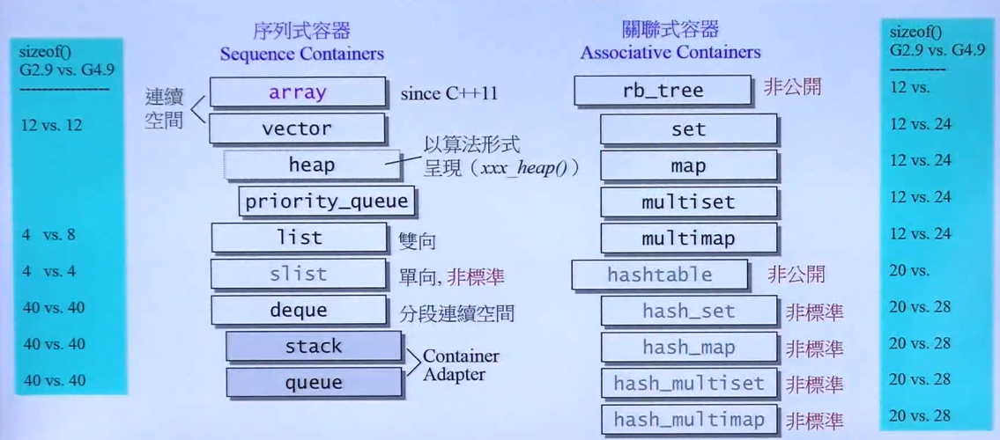
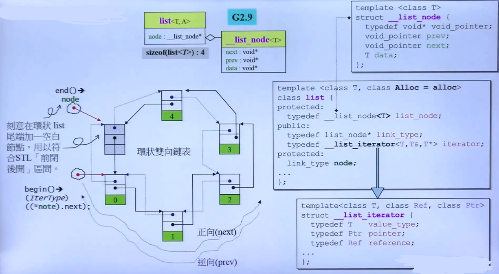
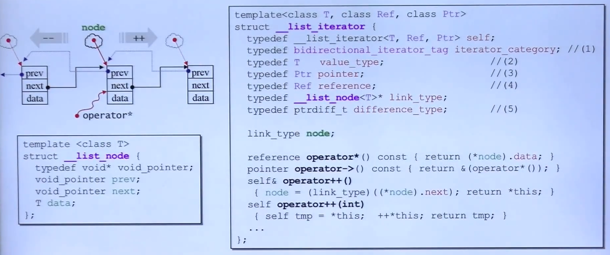
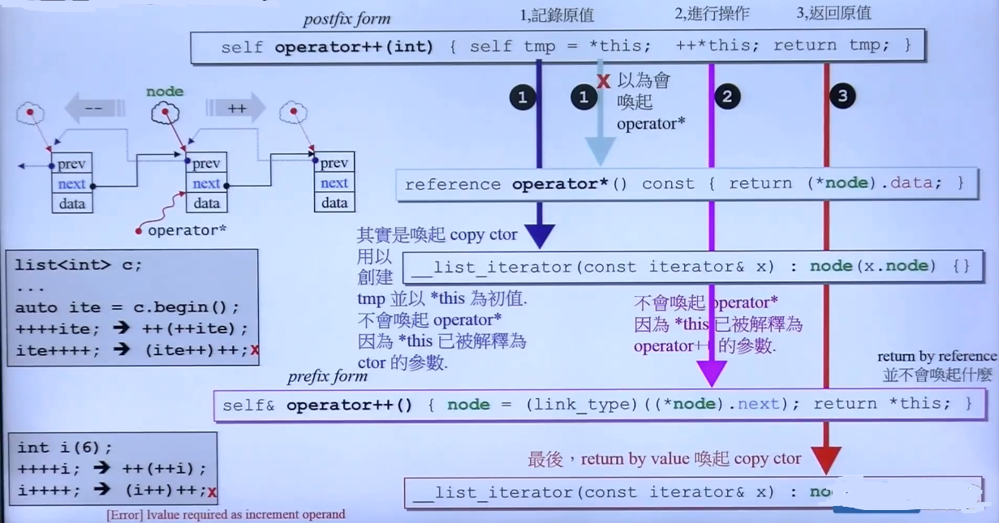
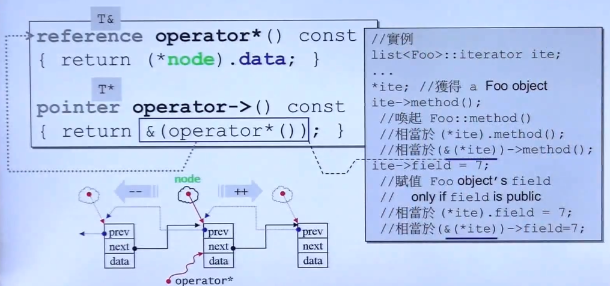
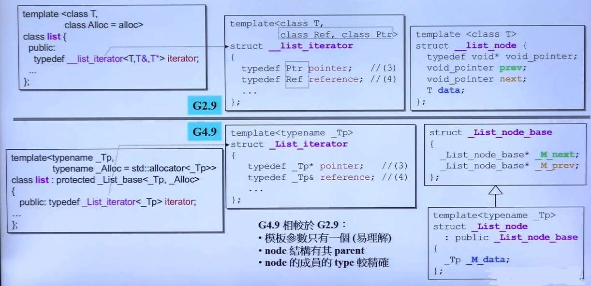
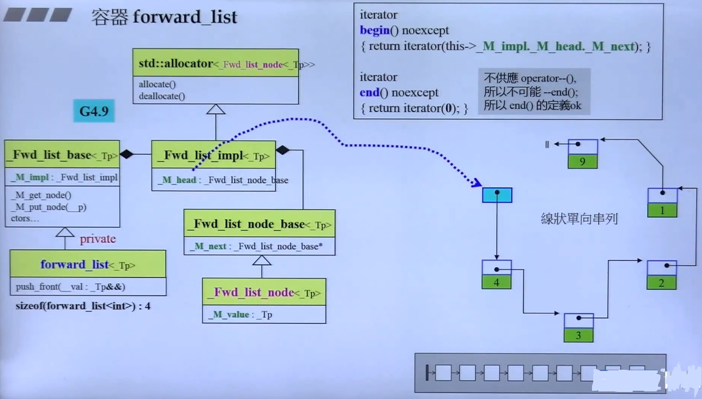

## 容器

**1. 容器之间的实现关系与分类**

- 各种容器之间的关系概览

	
    
    - **Notes**

		- 容器之间的缩进表明容器之间的**"基于"**关系
		- 例如 heap 是基于vector上实现的，set是基于红黑树实现的
		- 类与类之间的复用方法：1）类中声明另一个类的对象 2）继承
		- sizeof 表示数据结构本身所占的大小，与容器所含元素大小无关

**2. 深入探索 list**

- List 源码概览

	
    
    - **Notes**

		- **__list_node** 的前向指针，后向指针都是 **void\*** 类型，具体使用需要类型转换，这样设置并不优雅
		- list 申请内存时，除了申请数据内存，还需要多申请两个指针的内存 

- List的 **iterator** 的设计

	- **iterator** 概览
        
        - **Notes**

            - container 结构特征：**typedef** + **指针操作符(\*, ->, ++)**重载

	- **iterator** ++ 重载

		
        - **Notes** 

			- operator++(int) 表明重载后置++；operator++() 表明重载前置++
			- **\*node** 表明获取node指针对应的节点

			```C++
            // (*node).next 是 void* 指针， 这一步实现了node指向当前节点的next节点
            node = (link_type)((*node).next)
            ```
            - **\*this** 不会重载 **iterator**，返回实例对象本身 

			- 前置自增返回本身类型，后置自增返回本身类型的引用，只是为了与 **++++i**（支持）与**i++++**（不支持）对齐

			- \*运算符表示获取list 节点的data

		
 
 	- G4.9链表的设计更新
 
 		
        
        - **Notes**

			- iterator 模板参数只有一个
			- 将node 划分为 指针 + 数据 （解耦合）

- forward list

	