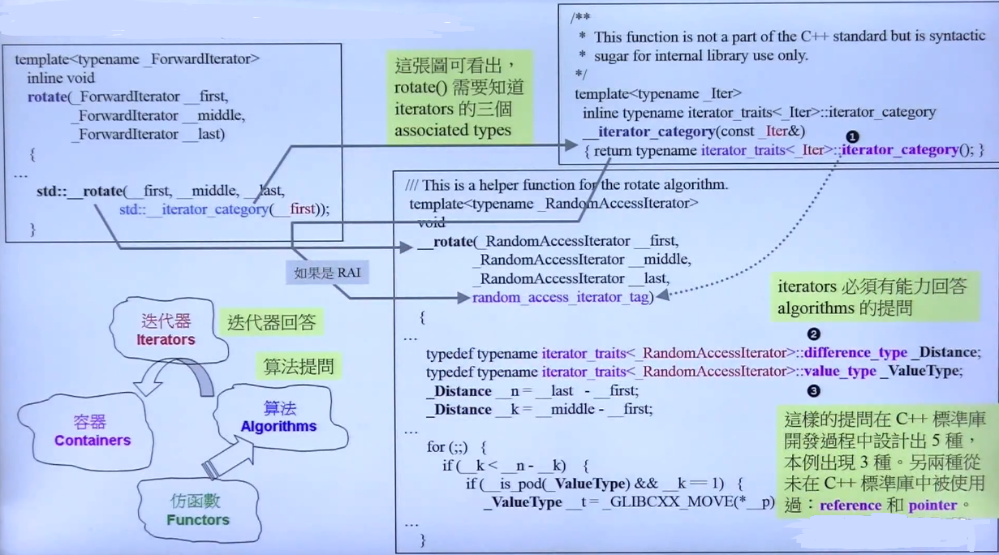
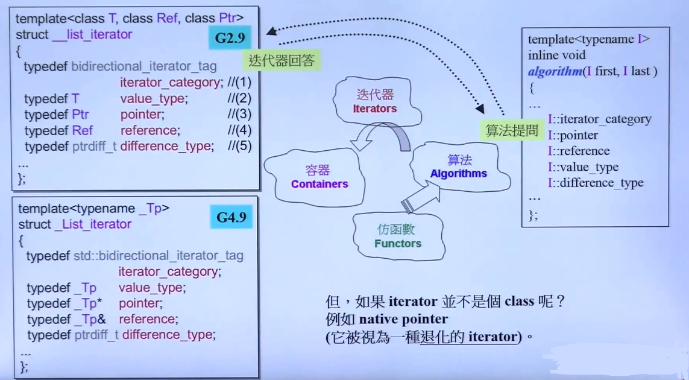
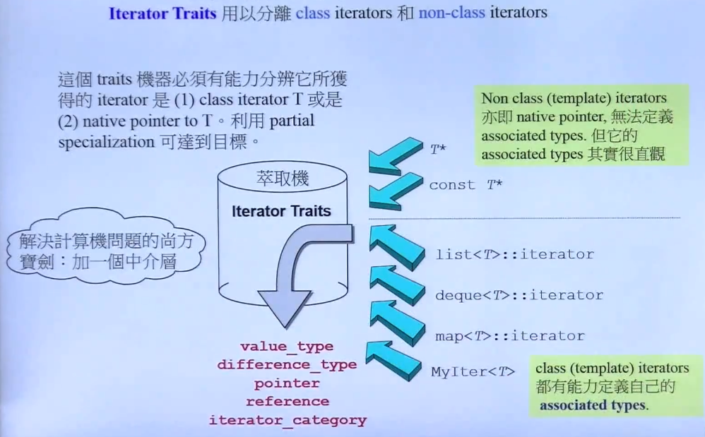
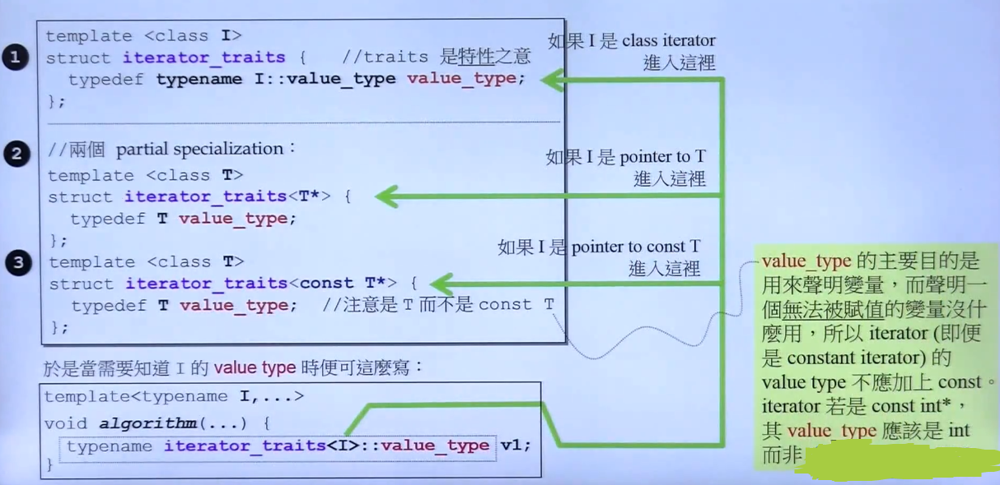

## Itorator

- 从算法 **rotate** 函数查看 **iterator** 的基本特性 **iterator traits**

	
    
    - **Notes**

		- rotate 算法 对 iterator 的三个属性需求（共有5种）
            - **iterator_category()** 表示 iterator 的移动性质（向前，向后，或者其他移动方向）
            - **value type** 表示iterator所指向的数据类型
            - **difference type** 表示 **itorator** 与 **iterator** 之间的距离表示
            - 另外两种未使用
            - 因为 container 提供 iterator 供算法使用， 所以必须 typedef 出上述 5 种类型  

		- 以 list iterator 为例的 typedef
		
        	- **Notes**

				- iterator_category 表征了链表类型（单向 or 双向）
				- difference_type 目前被 stl 定义为 长整型
				- value_type 表征了 list 存储的数据类型
				- pointer 表征了 list 存储的数据类型指针

- 分离 class itorator 以及 一般指针

	由于算法获取的迭代器不一定是 class itorator， 而是一般指针类型，就无法在特定命名空间中 typedef 出算法需求的那五种定义(这种直接在命名空间中 typedef 会污染命名空间，但其实只有 算法 会用到)，则就需要 Iterator Traits 介入
    
    
    - 处理技巧 --- 偏特化

		
        
        - 在直接返回 对应 container 的 value type上 加上 普通指针的 偏特化