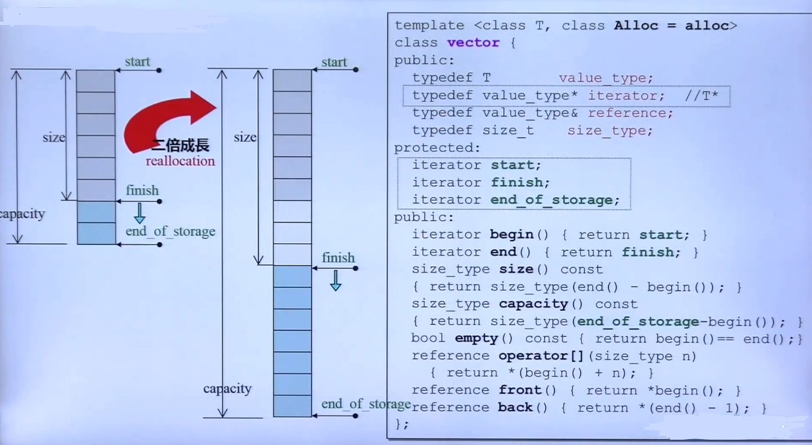
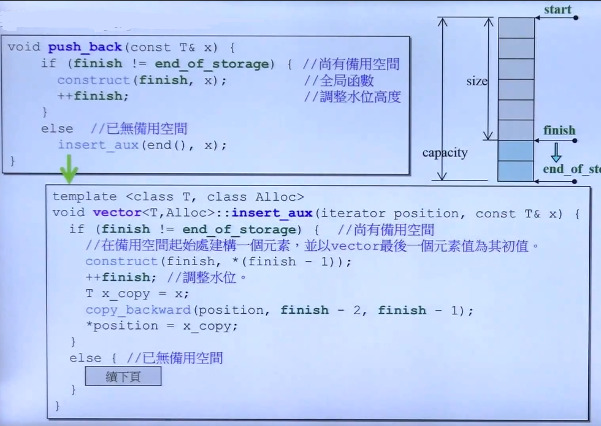
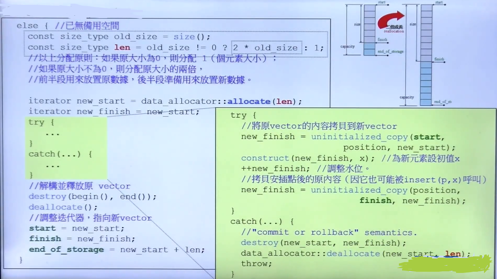
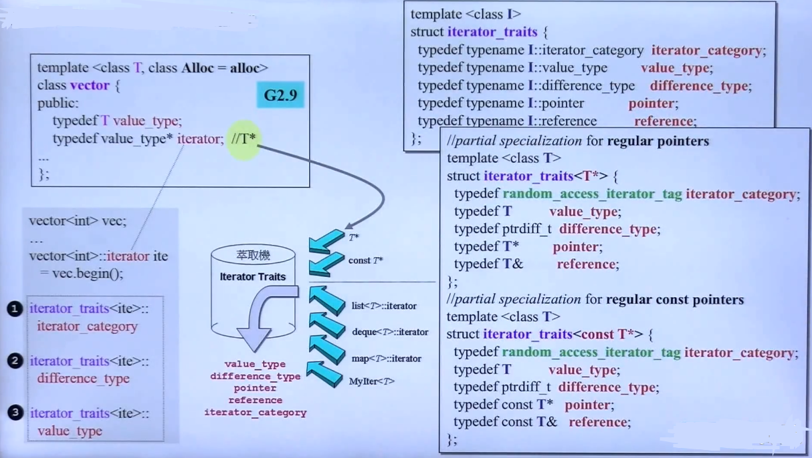
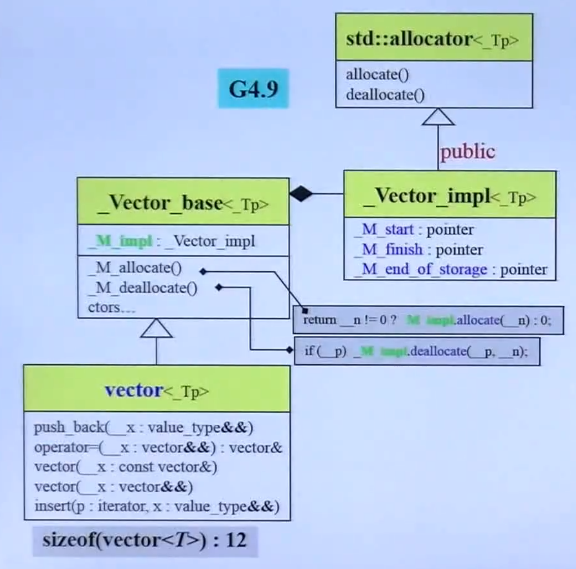
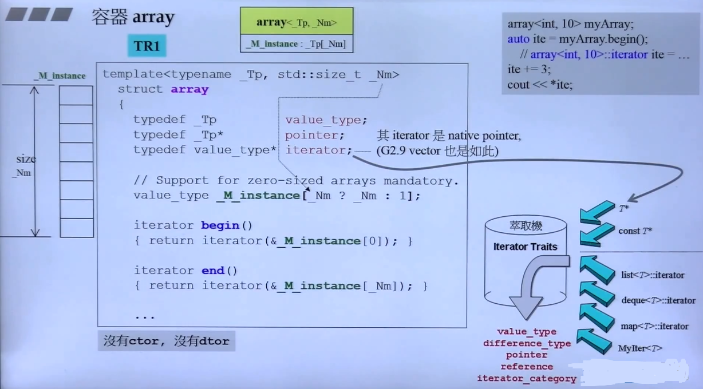

## 深入探索 vector array

- **vector 的自动扩充机制** 

	
    
    - **Notes**

		- 空间两倍扩充机制
		 
         
         	- insert aux 会多做 push back 的一次元素是否放满的检查
         	- 扩充算法：
         		1. allcator 申请2倍内存空间
         		2. 将更新位置元素之前的内容直接拷贝
         		3. 更新下一位置元素
         		4. 拷贝插入位置之后的内容
         	- 每一次扩充数据都会大量调用 构造 析构函数，产生大量开销

		- vector iterator traits

			 
             - 偏特化的 traits

- 新版本的 public 继承的思考

	
    
    - **关于新版本的 Vector_impl 继承 allocator 使用 public 继承的问题**

		- C++ 中 public 继承 是 **is、=** 的关系，这里表征 vector 就是 allocator 是不准确的，所以应当为 private 继承

- **array**
	
	