## deque/stack/queue 的深度探索

**deque**

- stl 中 deque 的实现策略

	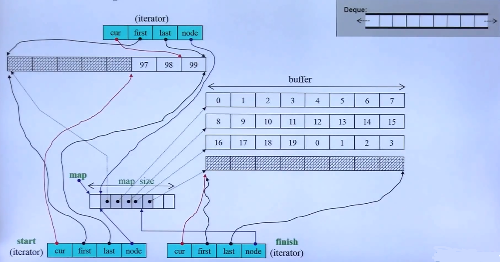
    
    - **Notes**

		- 分段连续内存实现

			- 通过存储指向各个分块内存指针的**vector**实现
			- deque的 iterator 包含了**四部分**；cur 指向当前元素；first 标志本块区域的起始位置；end表示本块区域的终止位置；node指向整个 deque 映射的 vector 位置

- stl 中 deque 的实现源码
 
 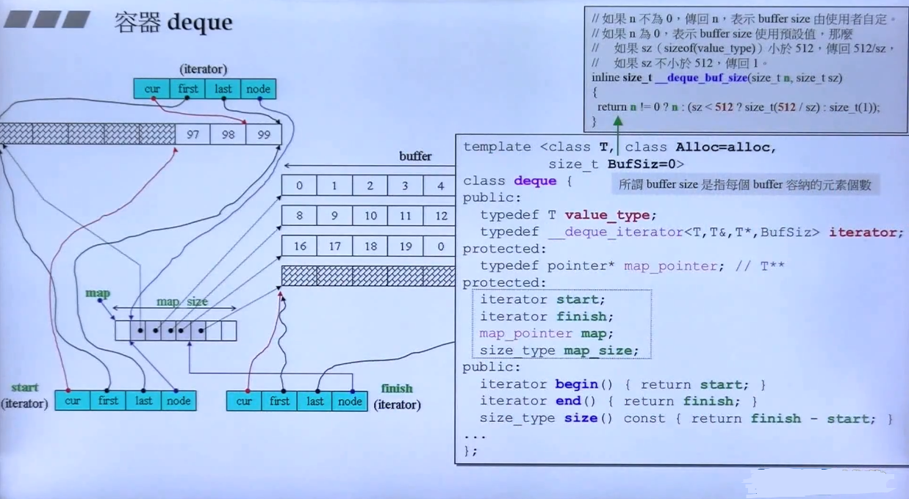
 
 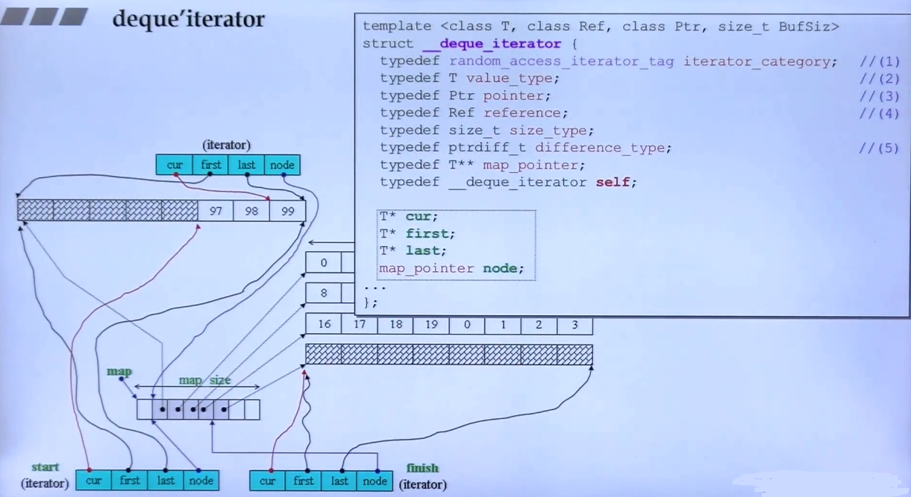
 
 - **Notes**

	- **deque** 的大小
	- 一个迭代器大小为16、两个指针大小各为4，共有40个字节
	- **map_pointer** 表示 deque 存储类型指针的指针 T\*\*，因为 vector 本身存储的就是指针
	- **start** 和 **finish** 是 deque 私有的迭代器类， 封装了上述的4部分

- **deque 的迭代器插入实现源码** 

	插入原则：优先向移动数据量较小的方向插入元素
	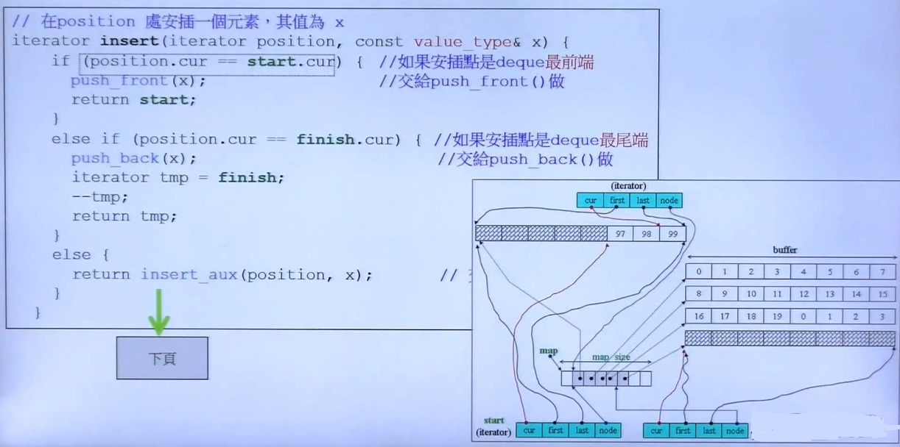
    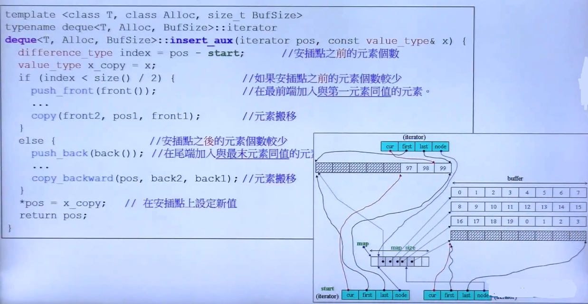
    
    - **Notes**

		- 实现方式：通过与中点的位置比较，在前则前端元素向前移动，否则向后移动

- **deque 对连续空间的模拟方法**

	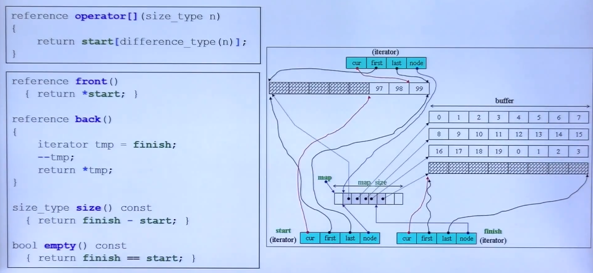
    
    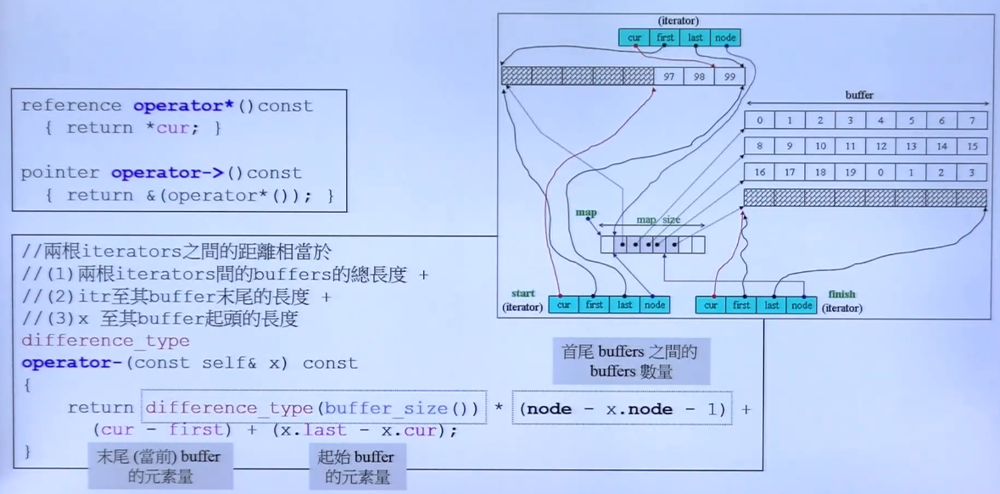
    - **Notes**
        - buffer_size() 表示每一块区域的数据量大小
        - node - x.node - 1 表征了vector中，当前块指针到x块指针的距离（块数），-1 是去掉x本身和当前块本身的尺寸（因为可能不满整个块的量），就是两者中间完整的buffer_size()的块数
        - 并加上两个缓冲区各自的数量

 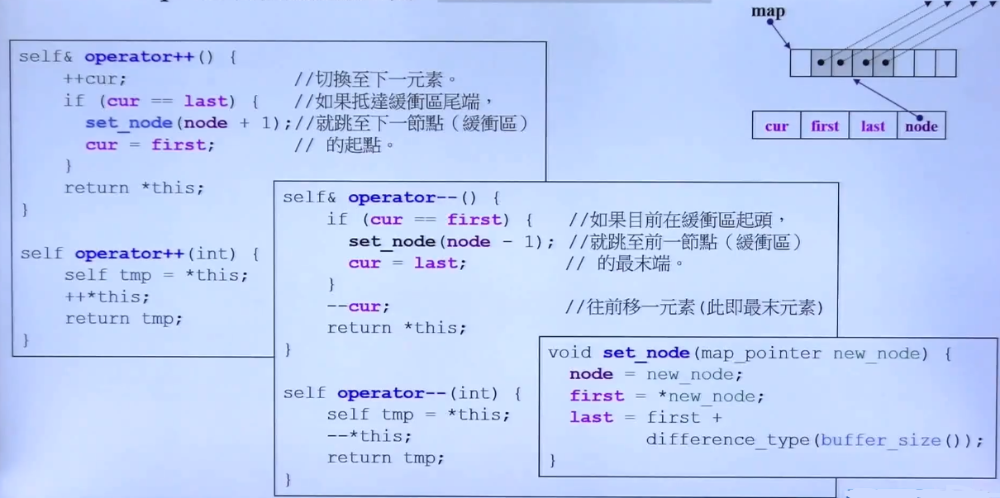
    
    - **Notes**

		- **后置自增运算 operator++(int) [a++] 调用前置自增 operator++() [++a] 计算，是重载自增操作的编程范式**
		- set_node 重设下一个节点

			- 自增到块的终点边界时通过 vector 查找下一个块的指针，并指向下一块区域的首个元素；自减到块的起始边界，还是通过 vector 查看上一个块的指针，并指向上一个块的元素末尾

 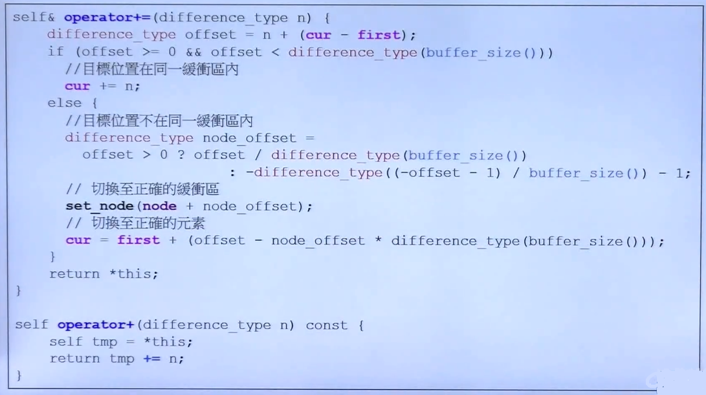
	- **Notes**

		- 当 iterator 发生 += n 的操作时，就需要进行以下算法实现

			- 首先判断 iterator += n 是否会跨越缓冲区

				- 如果不会跨越，则直接移动
				- 否则，需要对 buffer_size() 取模，得到跨越缓冲区的大小（块的数量），在 vector 中偏移块的数量，然后在移动到的块中移动 对 buffer_size() 取余个偏移量

		- 通过 += 实现 -=， 以及 索引 $[ ]$操作

- **deque 新版本实现**
	 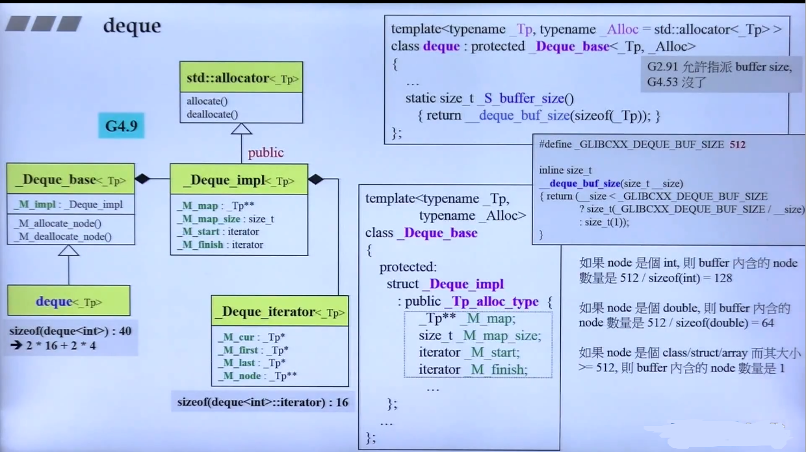	

- **stack与queue的实现**

    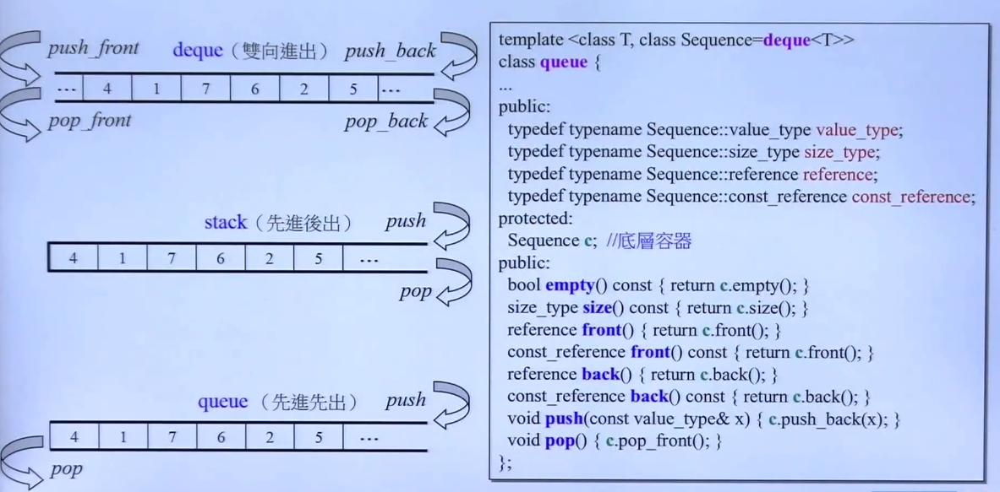
    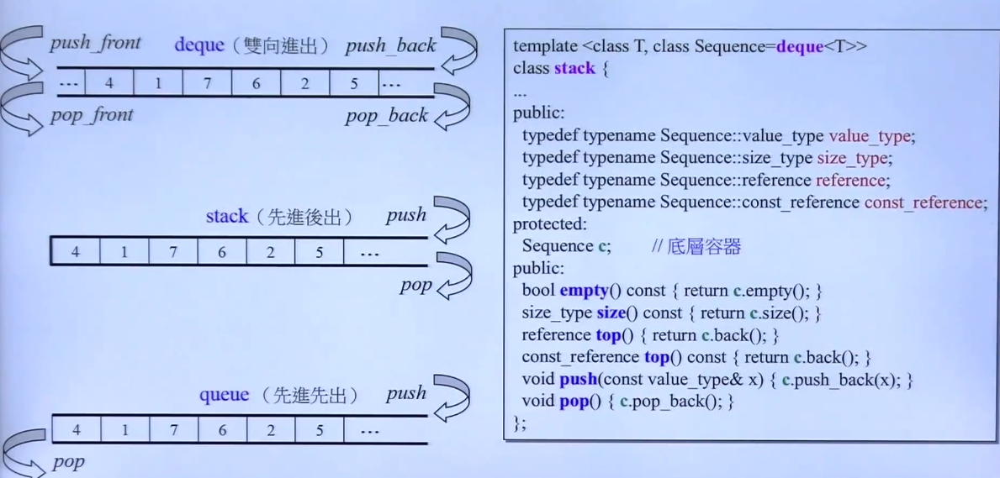
	基于 deque 的转调用，部分接口封闭来使用
    
    - 基于非默认 （deque） 的 stack 或 queue 实现
    
    	主要是 非默认是数据结构是否实现了 stack 或 queue 的相关方法
    	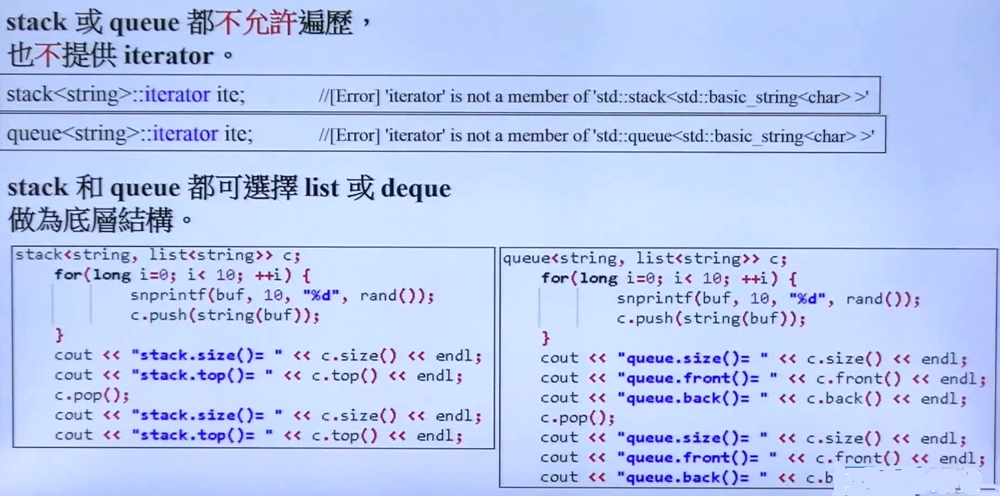