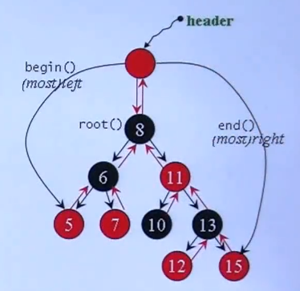
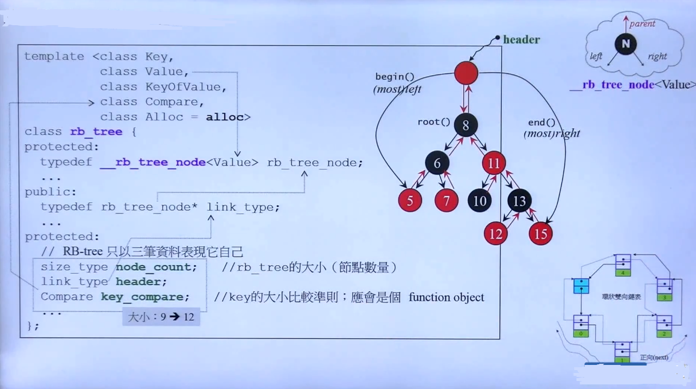
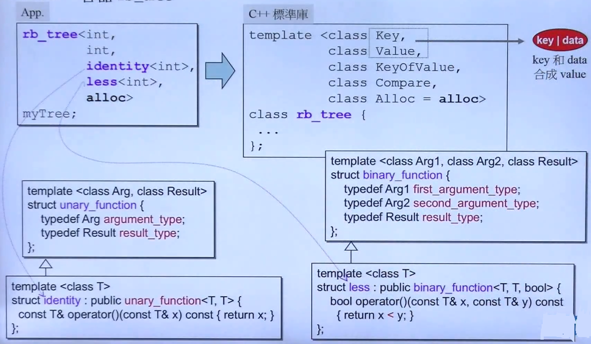
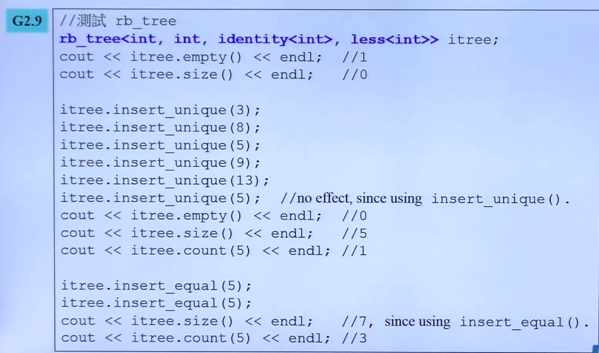
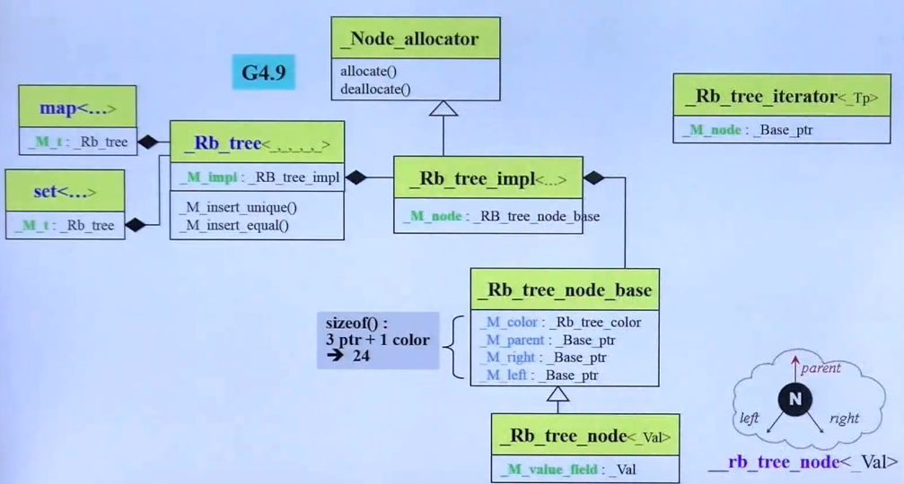
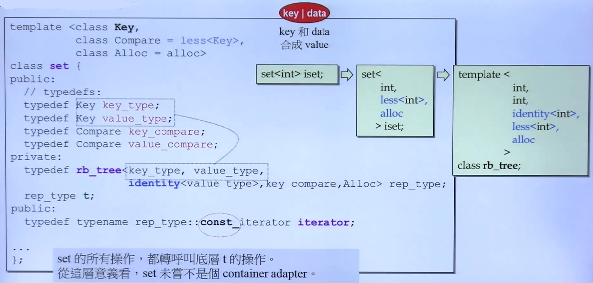

## RB-Tree 、 set、 multiset深度探索

- 关联式容器

	实现主要是基于红黑树和 HashTable
    
- 红黑树

	
    
    - **Notes**
    
    	- 红黑色是高度**平衡二叉搜索树**常用的一种，排列规则有利于元素搜索和插入。
    
    	- 搜索顺序 
    	
    		深度优先搜索 （左根右的中序遍历），可以通过迭代器 iter++ 来进行遍历
    	- **不应该**修改 RB-tree 中的元素

			编程层面允许，但不应该改
            
        - 提供两种 insertion 操作

			insert_unique 和 insert_equal，表示插入元素是否允许重复
  
 - STL对 RB-Tree的实现源码

	
	- **Notes**

		- 红黑树的元素为 key | data
		- KeyOfValue 表征了 key 的 get 方法
		- Compare 表征了比较的方法
		- 内部数据: node_count 表征了红黑树的节点数量；header 表征根节点；key_compare（可以为仿函数）
		- 类的大小：涉及到4字节对齐: 9 -> 12
	
    
    - **Notes**

		- identity 是一个函数对象，即仿函数，这个是在 GNUC 中定义的
		-  less 是标准库自由的函数

 - rb-tree的使用范式

	

 - G4.9 OOP的设计原则
	
    
	- **Notes**

		- 将类的接口 (handle) 与 实现 （body）分离

- Set，muliset

	a. 以 rb_tree 为底层结构，**元素的value和key合一，value就是key**
    
    b. 提供遍历操作的迭代器
    
    c. **不允许改变元素值**
    
    d. set 的 key 必须独一无二，insert() 调用的是 rb_tree 的 insert_unique；multiset 的 key 允许重复，insert() 调用的是 rb_tree 的 insert_equal
    
- set 的 STL 实现

    
    - **Notes**

        - set 使用红黑树是通过声明一个rb_tree的 **实例对象** 来实现的，而不是继承 
        - const_iterator 

            不允许改变迭代器指向的元素
        - 像这样不使用容器本身进行操作，而是转调用其他容器实现，这种方法称为 **容器适配器**， 所以 set 也是 container adapter

    

	