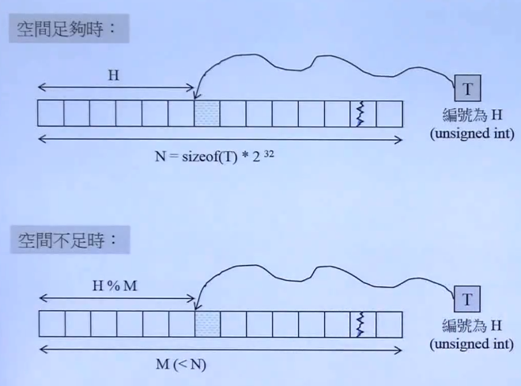
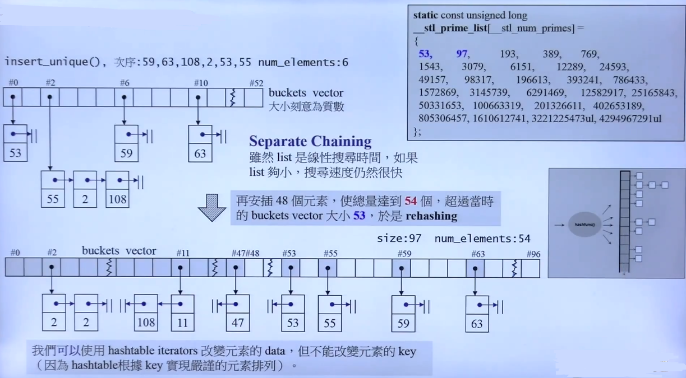
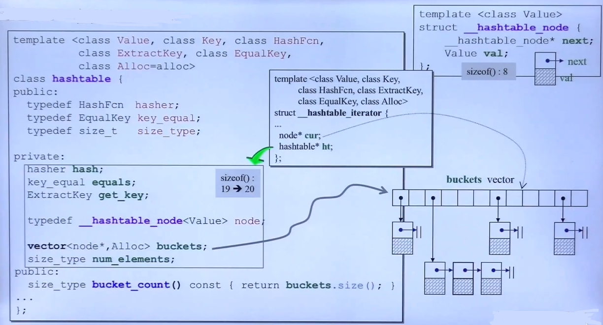
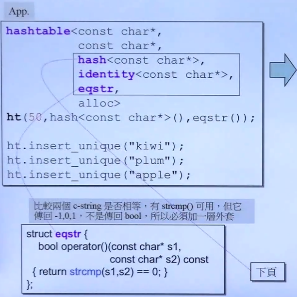
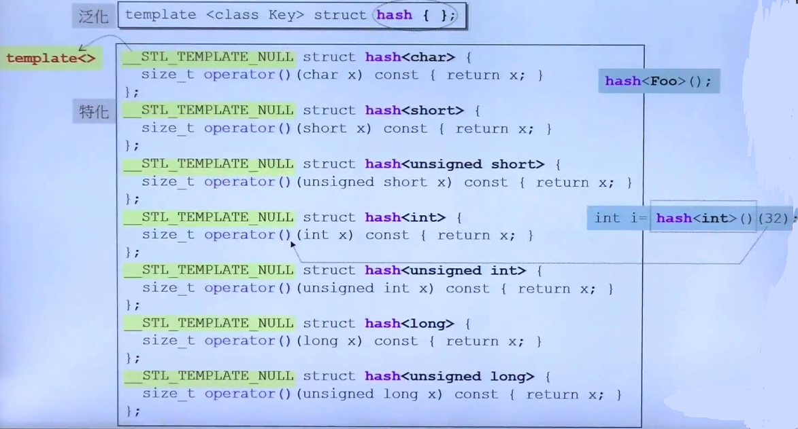
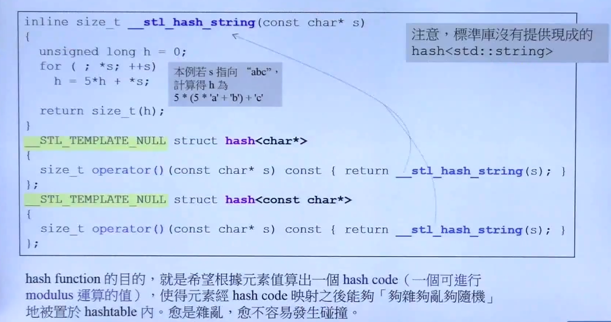
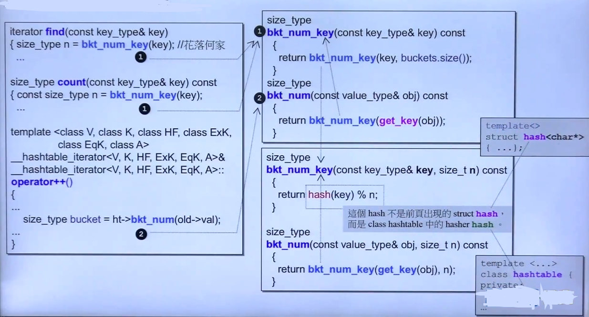
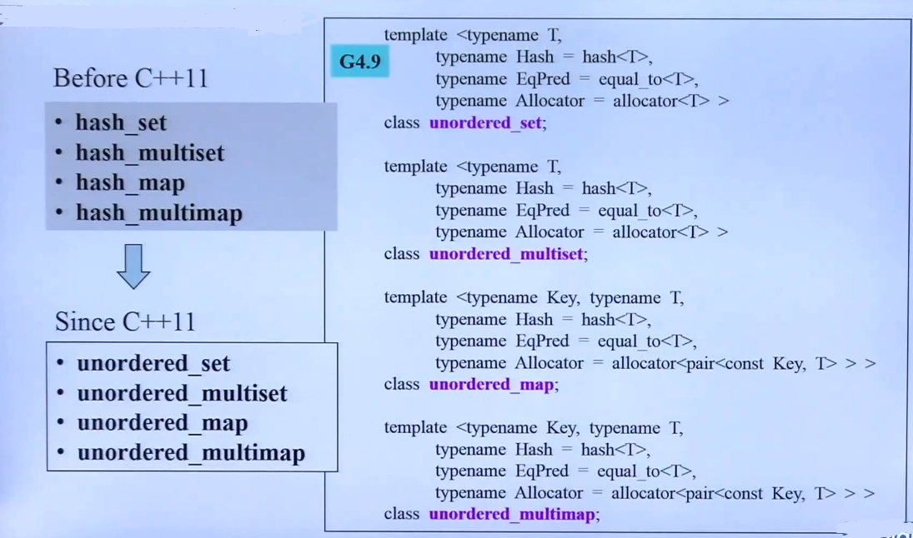

## HashTable 的深度探索

- HashTable

	- 问题引入

		有大量的 OBJ 通过某种映射，映射为一种编号，放在对应编号的内存里
        
       
        - **Notes**

			- 内存充足时，采用一一映射，但是在元素稀疏的情形比较浪费内存
			- 内存不足时，通过取模映射，则会产生，两个不同的元素映射到同一位置，就会发生碰撞
			- **解决碰撞的方法**：

				- 这个是 Hash 的核心，可以通过另一种函数映射到另一位置，防止碰撞，但是不够好

	

    	- **Notes**

			- 通过链表将碰撞的元素进行串接
			- 如果串接的链表过长，就必须打散整个 HashTable 

				- 原则是链表串接的元素个数比本身hash table 的元素还要多，就要进行打散
				- 打散（**rehashing**）扩充以2倍开始的质数，而且在GNUC中被写死

- HashTable 的 STL 实现

	
	- **Notes**

		- HashFcn 表征了 hash 编码函数，ExtractKey 提供获取 object 的 key 方法，EqualKey 表征了 Key 的相等方法
		- bucket 是用 vector 实现的
		- hash iterator 提供了指向当前元素的指针，同时给出了查找原始 bucket的指针ht

	
	- **Notes**

		- eqstr 是对 c接口 strcmp 的封装。因为 此处仿函数 需要传出 bool 值
	
    
	
	- **Notes**

		- hash func 是使用 偏特化模式实现的，如果是数值，数值本身就是编号，对于不存在的 obj，则需要手动设计 哈希函数，比如 std::string

    
	- Notes

		- Hash code 到 bucket 的映射

- C++11 的更新 Unordered 容器

	